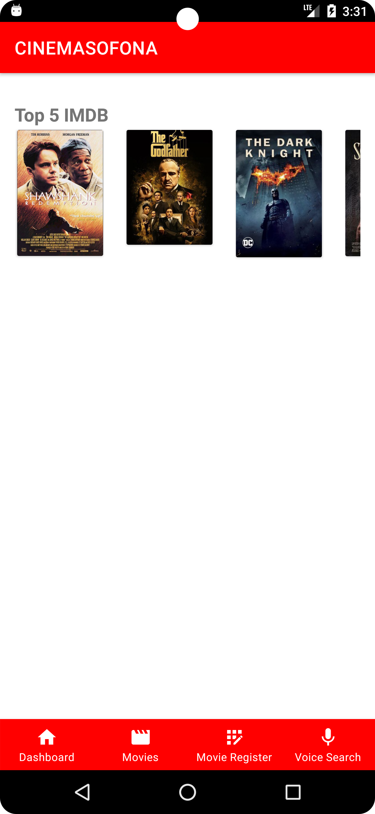
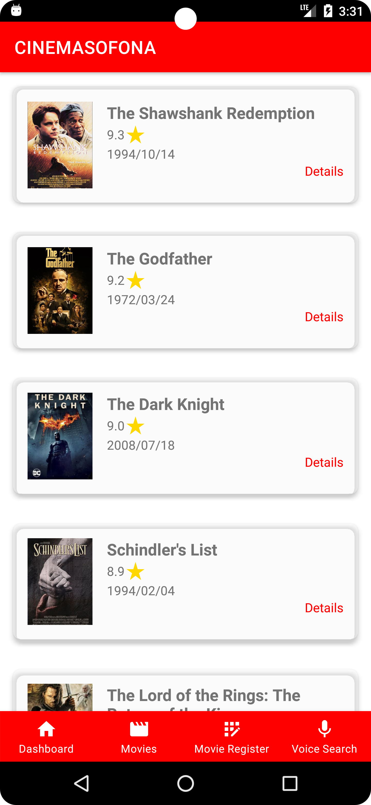
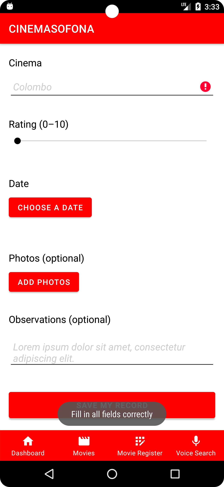
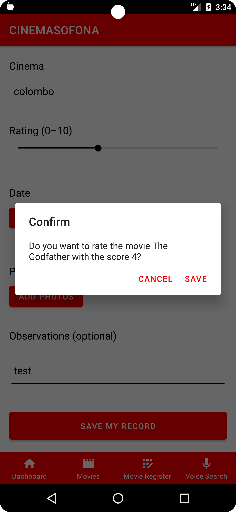
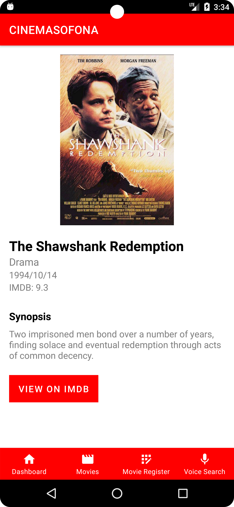
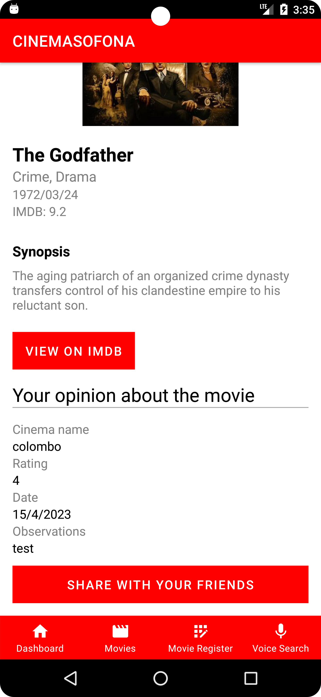
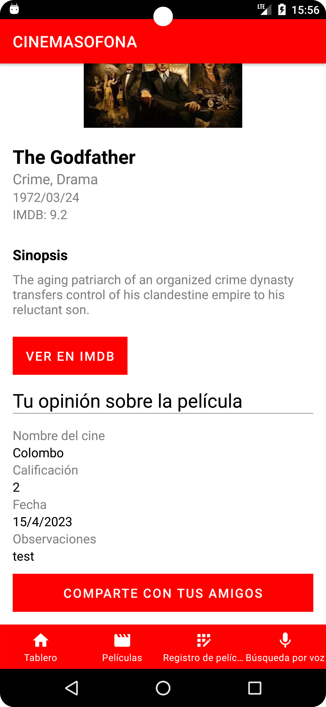
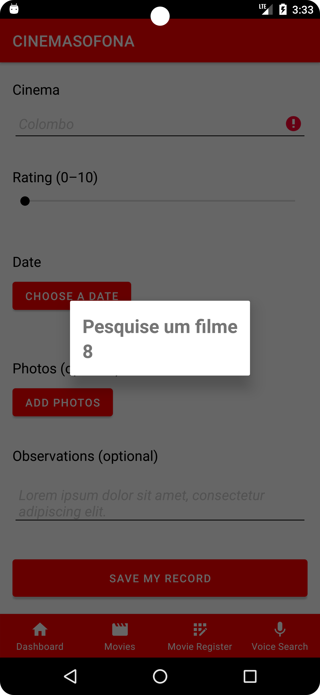
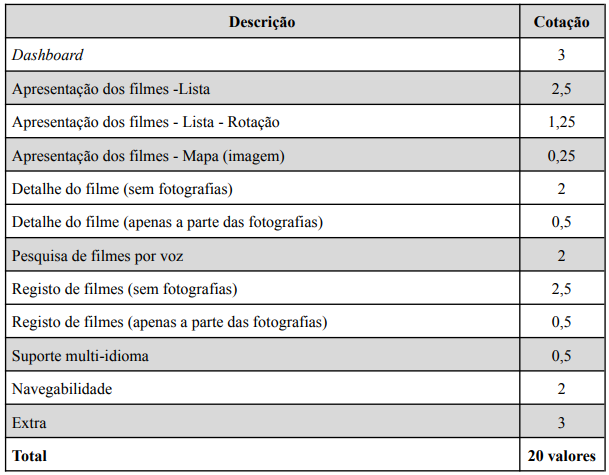

# Cinemas_app
1. Aplicação móvel desenvolvida em Android Nativo na linguagem Kotlin para a disciplina de 
Computação móvel, com o .apk testado no Pixel 6 Pro API 23.
2. Esta aplicação foi desenvolvida e teve por base o nosso protótipo desenvolvido na disciplina de
IHM, que pode ser encontrado aqui:
 * link: https://e535pj.axshare.com/#id=a47ouu&p=main_page&g=1

## Dados de aluno

Nome: João Pedro Matos  
Número: a22202497 
Nome: Ricardo Gonçalves  
Número: a22000492 

## Screenshots dos ecrãs

### Dashboard Screen (1):     
### Movies Screen (2):     
### Movie Register Screen (1):     
### Movie Register Screen (2):     
### Movie Register Screen (3):     
### Details Screen (1):     
### Details Screen (2):     
### Details Screen (3):     
### Share (1):     
### Share (2):     
### Voice (1):     

## Nomes dos filmes em hardcoded (movies.json)
* 1 - The Shawshank Redemption
* 2 - The Godfather
* 3 - The Dark Knight
* 4 - Schindler's List
* 5 - The Lord of the Rings: The Return of the King

## Funcionalidades
### Table:     

here is a table with the functionalities of the app

## Classes de lógica de negócio

## Idiomas (Multi-language)
* Inglês (default)
    
* Português
    
* Espanhol
    

## Autoavaliação
Nota: 18 valores

## Classes de lógica de negócio

## Referências
 

 