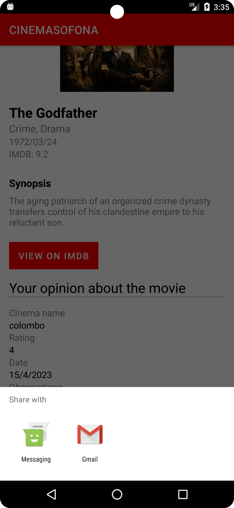
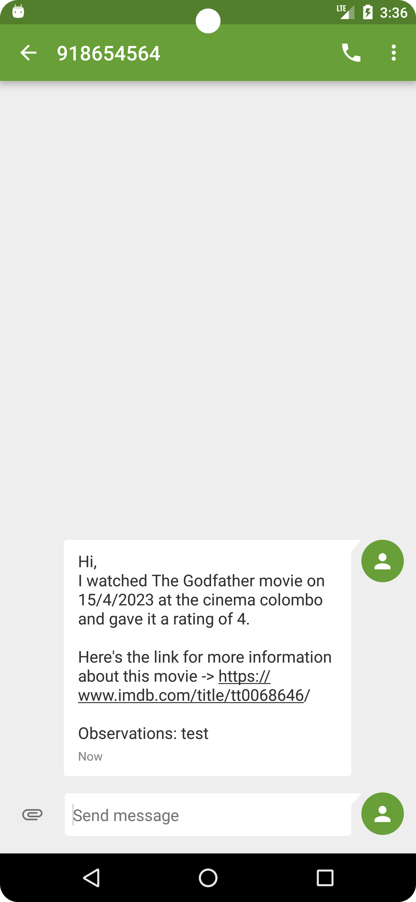
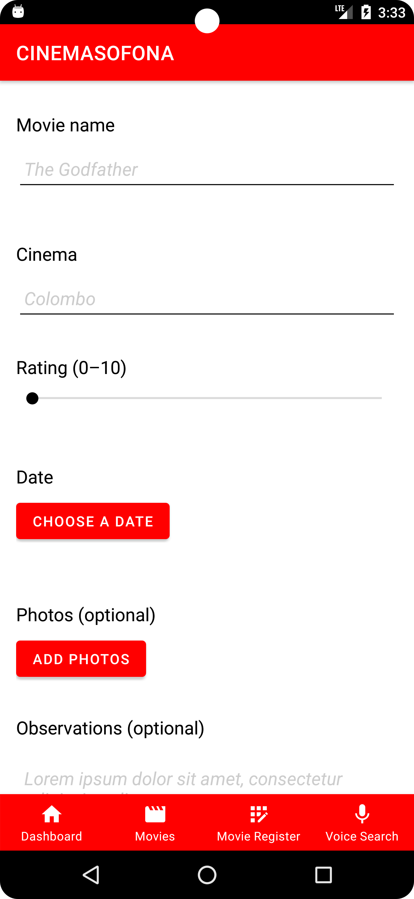
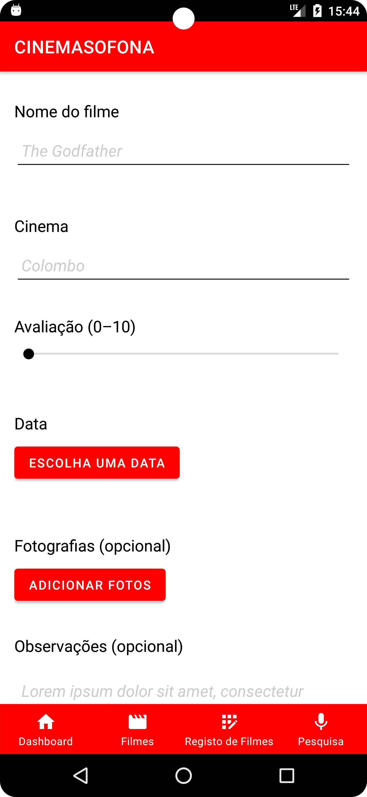
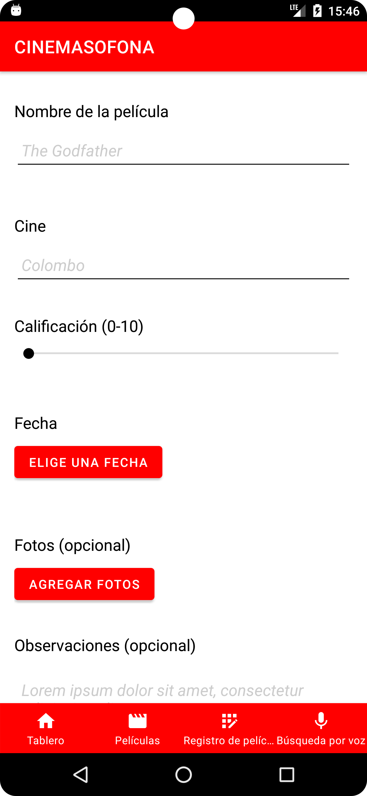

# Cinemasofona
1. Aplicação móvel desenvolvida em Android Nativo na linguagem Kotlin para a disciplina de 
Computação móvel, com o .apk testado no Pixel 6 Pro API 23.
2. Esta aplicação foi desenvolvida e teve por base o nosso protótipo desenvolvido na disciplina de
IHM, que pode ser encontrado aqui:
 * link: https://e535pj.axshare.com/#id=a47ouu&p=main_page&g=1

## Dados de aluno

Nome: João Pedro Matos  
Número: a22202497 
Nome: Ricardo Gonçalves  
Número: a22000492 

## Screenshots dos ecrãs

### Dashboard Screen (1):     
### Movies Screen List (2):     
### Movies Screen Map (2):     
### Movie Register Screen (1):     
### Movie Register Screen (2):     
### Movie Register Screen (3):     
### Details Screen (1):     
### Details Screen (2):     
### Share (1):     
### Share (2):     
### Voice (1):     
### Voice (2):     
### Voice (3):     

## Funcionalidades
### Table:     

Das funcionalidades mencionadas na tabela anterior, foram implementadas todas excepto o extra.

## Idiomas (Multi-language)
* Inglês (default)
    
* Português
    
* Espanhol
    

## Autoavaliação
Nota: 18 valores

## Link do vídeo
https://youtu.be/ZMNf1eNuzDY

## Classes e atributos
**Classe Movie:**
 -Atributos:
    * id - String,
    * name - String,
    * year - String,
    * photo - String,
    * genre - String,
    * synopsis - String,
    * releaseDate - String,
    * imdbRating - Double,
    * imdbLink - String;
  -Métodos:
    * toMovieDB() - MovieDB;

**Classe MovieRegistry:**
  -Atributos:
    * id - Long,
    * movie - Movie
    * cinema - Cinema,
    * rate - Int,
    * seen - String,
    * observations - String,
    * images - List<RegistryImage>;
  -Métodos:
    * toMovieRegistryDB() - MovieRegistryDB,
    * rateColor() - Float;

**Classe History:**
  -Métodos:
    * loadCinemas() - List<Cinema>,
    * getCinemaByName() - Cinema?;

**Classe Cinema:**
    -Atributos:
        * id - Long,
        * name - String,
        * provider - String,
        * address - String,
        * latitude - Double,
        * longitude - Double,
        * county - String;
    -Métodos:
        * toCinemaDB() - CinemaDB;

**Classe RegistryImage:**
    -Atributos:
        * id - Long,
        * uri - String,
        * movieRegistryId - Long;
    -Métodos:
        * toRegistryImageDB() - RegistryImageDB;

**Class MarkerData:**
    -Atributos:
        * marker - Marker,
        * registryId - Long;
    -Métodos:
        * toMarkerDataDB() - MarkerDataDB;

## Idioma

## Referências
Para as funcionalidades que não foram dadas em aula utilizámos apenas o ChatGPT. 
